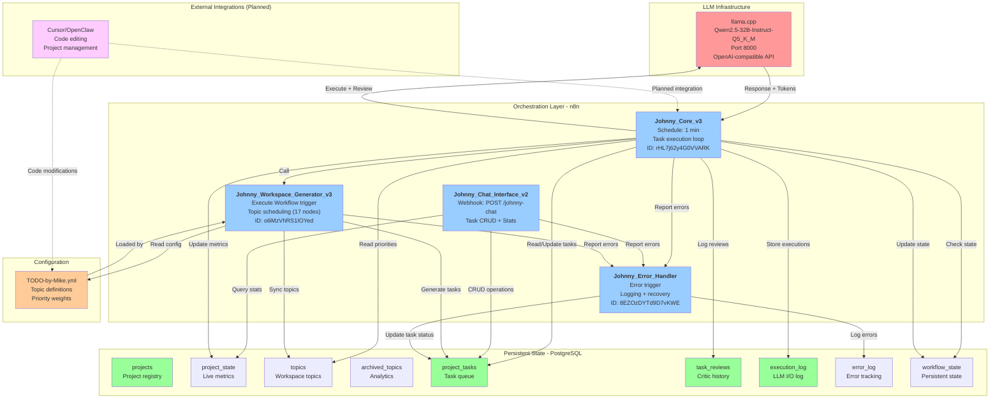
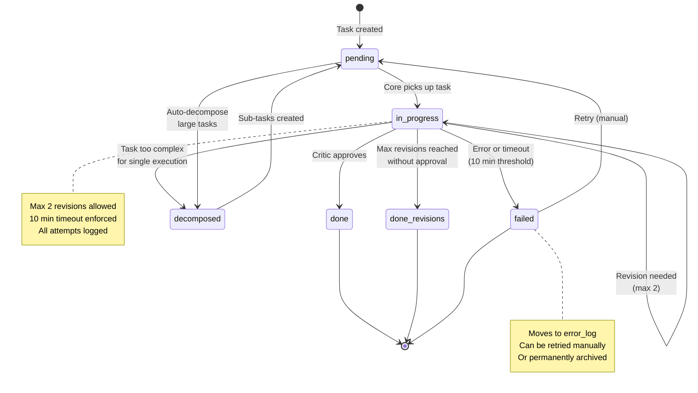

# Johnny Bright - Autonomous AI Task Orchestration System

## 1. System Overview

**Johnny Bright** is an autonomous AI employee that manages and executes tasks with continuous self-improvement. Running 24/7, this system orchestrates work through intelligent scheduling, execution, and critic-driven review loops.

### Core Philosophy
- **Autonomy**: Operates without human intervention, picking tasks based on weighted priorities
- **Self-Review**: Every execution is reviewed by a strict critic at temperature 0.1 for quality assurance
- **Continuous Improvement**: Tracks performance metrics and optimizes task scheduling over time
- **Scalability**: Built on n8n for workflow orchestration and PostgreSQL for state persistence

### Technical Stack
- **Orchestration**: n8n (workflow automation, running in Docker)
- **Database**: PostgreSQL (state persistence, execution logs, task management)
- **LLM Engine**: llama.cpp running Qwen2.5-32B-Instruct-Q5_K_M (local inference, no external API calls)
- **Configuration**: YAML-based topic management
- **Infrastructure**: Docker & Docker Compose for containerized deployment

---

## 2. Architecture Diagram



---

## 3. Workflow-Liste

| Workflow | Trigger | Zweck | Status | ID |
|----------|---------|-------|--------|-----|
| Johnny_Core_v3 | Schedule (1 min) | Task execution + critic review loop + WRR scheduling | active | rHL7j62y4G0VVARK |
| Johnny_Chat_Interface_v2 | Webhook POST /johnny-chat | Chat API for task CRUD + statistics reporting | active | (see n8n UI) |
| Johnny_Workspace_Generator_v3 | Execute Workflow (called by Core) | Topic scheduling + task generation from YAML config (17 nodes) | passive | oiliMzVhRS1IOYed |
| Johnny_Error_Handler | Error Trigger | Error logging + stuck task recovery + notifications | active | 8EZOzDYTd9D7vKWE |

---

## 4. Task Lifecycle - State Machine Diagram



---

## 5. Datenbank-Schema Übersicht

### Core Tables

#### **projects**
- **Zweck**: Project registry and metadata
- **Key Fields**: id (SERIAL PK), name (TEXT UNIQUE NOT NULL)
- **Sample Data**: `INSERT INTO projects (name) VALUES ('Johnny Bright');`

#### **project_state**
- **Zweck**: Live metrics and summary per project
- **Key Fields**: id (SERIAL PK), project_id, summary (TEXT), total_tasks_completed, last_summary_at
- **Purpose**: Real-time dashboard metrics and performance tracking

#### **topics**
- **Zweck**: Active workspace topics from YAML configuration
- **Key Fields**: id (TEXT PK), priority (1-5), weight, maxcount, max_tasks_per_cycle, description, remaining_count, last_served_at, created_at
- **Hinweis**: Kein `project_id`-Feld. Topics werden direkt über `id` referenziert.
- **Loaded By**: Johnny_Workspace_Generator_v3 from TODO-by-Mike.yml
- **Lifecycle**: Auto-synced when YAML changes. Topics bleiben im YAML auch wenn maxcount=0 (werden nicht gelöscht).

#### **archived_topics**
- **Zweck**: Completed topic analytics and historical reference
- **Key Fields**: id (TEXT), description, total_tasks, total_input_tokens, total_output_tokens, total_tokens, archived_at, summary
- **Purpose**: Trend analysis and performance benchmarking

#### **project_tasks**
- **Zweck**: Core task queue and execution history (master table)
- **Key Fields**:
  - id (SERIAL PK), project_id (FK→projects), topic_id (FK→topics, nullable)
  - parent_task_id (FK→project_tasks, nullable, für Decomposition)
  - description (TEXT NOT NULL)
  - status (`pending`|`in_progress`|`done`|`done_revisions`|`decomposed`)
  - source (`user`|`workspace`|`system`)
  - impact_score, urgency_score, complexity_score, priority_score (alle INTEGER)
  - total_tokens (INTEGER DEFAULT 0)
  - created_at, completed_at
- **Hinweis**: Kein `title`-Feld, kein `failed`-Status, kein `started_at`-Feld im aktuellen Schema
- **Indexes**: status, project_id, topic_id

#### **task_reviews**
- **Zweck**: Critic review history and quality metrics
- **Key Fields**: id (SERIAL PK), task_id, verdict (`approve`|`revise`), critic_comment, created_at
- **Analytics**: Used to calculate approval_rate, avg_revisions_per_task, verdict distribution

#### **execution_log** (geplant)
- **Zweck**: Full LLM I/O audit trail and token tracking
- **Status**: Noch nicht im aktuellen DATABASE.sql definiert, geplant für Phase 2
- **Geplante Fields**: id, task_id, execution_number, prompt, response, input_tokens, output_tokens, total_tokens, temperature, model_name, created_at, duration_ms

#### **error_log** (geplant)
- **Zweck**: Error tracking via Johnny_Error_Handler workflow
- **Status**: Noch nicht im aktuellen DATABASE.sql definiert. Errors werden aktuell über den n8n Error Handler geloggt.
- **Geplante Fields**: id, task_id, workflow_id, error_message, error_type, created_at

#### **workflow_state**
- **Zweck**: Persistent state for Weighted Round Robin and global settings
- **Schema**: `key TEXT`, `value JSONB`, `updated_at TIMESTAMP`
- **WRR Index**: Gespeichert als `key='wrr_index'`, `value='{"index": 0}'` (JSONB)
  - Lesen: `SELECT value->>'index' AS wrr_index FROM workflow_state WHERE key = 'wrr_index';`
  - Schreiben: `UPDATE workflow_state SET value = jsonb_set(value, '{index}', to_jsonb($1::int)), updated_at = NOW() WHERE key = 'wrr_index';`
- **Consistency**: Updated atomically by Workspace Generator to ensure deterministic scheduling

### Key Computed Field

```
priority_score = (impact * 4 + urgency * 4 + (100 - complexity) * 2) / 10
```

**Scale**: 0-100
- High impact, high urgency, low complexity = high priority
- Low impact, low urgency, high complexity = low priority
- Recomputed on task creation and when metrics change
- Used for sorting within each source tier (user → workspace → system)

---

## 6. Execution Priority Logic

Johnny Bright uses a **3-tier hierarchical priority system** to balance autonomy with user control:

### Tier 1: User Tasks (Highest Priority)
- **Source**: user
- **Selection**: All pending user tasks, sorted by priority_score DESC
- **Behavior**: Always executed before workspace or system tasks
- **Use Case**: Direct human requests, urgent fixes, ad-hoc work

### Tier 2: Workspace Tasks (Medium Priority)
- **Source**: workspace
- **Selection**: Selected via Weighted Round Robin (WRR) from topics in YAML
- **Behavior**: One task per Core cycle (1 min) when no user tasks exist
- **Use Case**: Planned work, feature development, research tasks

### Tier 3: System Tasks (Lowest Priority)
- **Source**: system
- **Selection**: Only executed when Tiers 1 and 2 have no pending tasks
- **Behavior**: Idle research mode, experimentation, self-improvement
- **Use Case**: Continuous learning, optimization, performance tuning

### Priority Score Components

Each task has three input metrics (0-100 scale):

| Component | Weight | Meaning |
|-----------|--------|---------|
| **impact** | ×4 | Business value: 0 = none, 100 = critical |
| **urgency** | ×4 | Time sensitivity: 0 = can wait, 100 = immediate |
| **complexity** | ×2 (inverted) | Difficulty: 0 = trivial, 100 = very hard |

**Formula**: `(impact × 4 + urgency × 4 + (100 - complexity) × 2) ÷ 10`

**Example**:
- Task A: impact=80, urgency=90, complexity=30 → score = (320 + 360 + 140) / 10 = **82.0**
- Task B: impact=40, urgency=20, complexity=70 → score = (160 + 80 + 60) / 10 = **30.0**
- Task A executes first

---

## 7. Weighted Round Robin Pattern

The Weighted Round Robin (WRR) ensures fair allocation of execution cycles across workspace topics while respecting priority levels.

### Pattern Definition

```
[1,1,1,1,1, 2,2,2,2, 3,3,3, 4,4, 5]
```

**Reading the Pattern**:
- Priority 1 topics appear 5 times
- Priority 2 topics appear 4 times
- Priority 3 topics appear 3 times
- Priority 4 topics appear 2 times
- Priority 5 topics appear 1 time
- **Total cycle length**: 15 executions

**Allocation**: Priority 1 gets 5× more task slots than Priority 5

### State Management

- **Storage**: `workflow_state` mit `key='wrr_index'`, `value->>'index'` (0-14)
- **Rotation**: Incremented by 1 each Core cycle, wraps to 0 at end
- **Update**: Atomic, synchronized by Core workflow
- **Determinism**: No randomness; always processes same topic at same pattern position

### Execution Algorithm

**Each Core cycle (1 min interval)**:

1. Check for pending user tasks → execute first tier
2. If no user tasks:
   - Read `workflow_state.wrr_index` (current position: 0-14)
   - Map index to priority: e.g., index=5 → priority=2
   - Query `topics` table with target priority
   - Select topic with highest priority_score
3. If target priority has no topics:
   - Fallback: Pick highest available priority with pending tasks
4. Select one pending task from chosen topic, ordered by priority_score DESC
5. Increment `wrr_index` → (wrr_index + 1) % 15
6. Execute selected task

### Fallback Behavior

If no topic at target priority has pending tasks:
```
Check priority 1 → 2 → 3 → 4 → 5 → idle
```

If all workspace tasks complete, system tasks execute. If all tasks complete, Core waits for next cycle.

### Example Rotation

```
Cycle 1: wrr_index=0 → priority=1 → enneagramm-ux topic → pick highest priority_score task
Cycle 2: wrr_index=1 → priority=1 → enneagramm-ux topic
Cycle 3: wrr_index=2 → priority=1 → enneagramm-ux topic
Cycle 4: wrr_index=3 → priority=1 → enneagramm-ux topic
Cycle 5: wrr_index=4 → priority=1 → enneagramm-ux topic
Cycle 6: wrr_index=5 → priority=2 → code-refactor topic
Cycle 7: wrr_index=6 → priority=2 → code-refactor topic
...
Cycle 15: wrr_index=14 → priority=5 → research topic
Cycle 16: wrr_index=0 → priority=1 → (wraps around)
```

---

## 8. Critic Review System

Every task execution is followed by an immediate critic review to ensure quality and consistency.

### Temperature Settings

| Component | Temperature | Purpose |
|-----------|-------------|---------|
| **Execution** | 0.4 | Balanced creativity and consistency; enables varied approaches |
| **Critic** | 0.1 | Strict, deterministic evaluation; consistent standards |

Low critic temperature ensures the same output receives the same decision across evaluations.

### Review Workflow

1. **Execution Phase**: LLM generates task response at temperature 0.4
2. **Critic Phase**: Same LLM reviews output at temperature 0.1 with prompt:
   ```
   Review this task execution and decide:
   - APPROVE: Output is correct, complete, and meets quality standards
   - REVISE: Output is partially correct but needs improvement
   - FAIL: Output is incorrect or cannot be salvaged
   ```
3. **Decision Logic**:
   - **APPROVE** → Move task to `done`, log success
   - **REVISE** → Store feedback, increment revision_count, re-execute (max 2 revisions)
   - **FAIL** → Move task to `failed`, log in error_log

### Revision Limits

- **Maximum revisions**: 2 per task
- **Behavior if max reached**: Move to `done_revisions` (completed but with revisions limit hit)
- **Rationale**: Prevent infinite loops; accept diminishing returns after 2 attempts

### Auto-Approve Safety Mechanism

- **Trigger**: JSON parse failure in critic response
- **Action**: Auto-approve task and log warning
- **Rationale**: Prevents system blocking due to LLM response format issues
- **Monitoring**: Track auto-approvals in execution_log.context

### Review Logging

All reviews stored in `task_reviews` table with:
- Task ID and attempt number
- Full execution output and critic feedback
- Decision (approve|revise|fail)
- Tokens consumed (execution + critic)
- Timestamp

### Critic Metrics

Computed daily from `task_reviews`:

| Metric | Calculation | Use |
|--------|-------------|-----|
| **approval_rate** | COUNT(decision='approve') / COUNT(*) | Quality indicator |
| **avg_revisions_per_task** | SUM(revision_count) / COUNT(distinct task_id) | Efficiency metric |
| **decision_distribution** | % approve, % revise, % fail | Process health |
| **avg_tokens_per_review** | SUM(tokens_used) / COUNT(*) | Cost baseline |

---

## 9. Token Tracking

Comprehensive token accounting for cost management and performance analysis.

### Token Collection Points

**Every LLM call logs**:
- `input_tokens`: Tokens in the prompt
- `output_tokens`: Tokens in the response
- `total_tokens`: input_tokens + output_tokens
- Stored in `execution_log` table

### Aggregation Pipeline

```
execution_log.total_tokens (per call)
    ↓
project_tasks.total_tokens (sum of all executions for task)
    ↓
project_state.total_tokens_used (sum of all tasks in project)
```

### Detailed Logging

Each row in `execution_log` includes:
- task_id, execution_number (1-3)
- input_tokens, output_tokens, total_tokens
- temperature, model_name
- duration_ms (latency tracking)
- created_at (timestamp)

### Analytics Queries

**Daily token usage**:
```sql
SELECT DATE(created_at), SUM(total_tokens) as daily_tokens
FROM execution_log
GROUP BY DATE(created_at)
ORDER BY 1 DESC
LIMIT 7;
```

**Token efficiency by topic**:
```sql
SELECT t.topic_id, COUNT(*) as tasks, SUM(pt.total_tokens) as total_tokens,
  AVG(pt.total_tokens) as avg_tokens_per_task
FROM project_tasks pt
JOIN topics t ON pt.topic_id = t.id
WHERE pt.status IN ('done', 'done_revisions')
GROUP BY t.topic_id
ORDER BY total_tokens DESC;
```

**Cost estimation** (assuming $0.00003 per token average):
```sql
SELECT SUM(total_tokens) * 0.00003 as estimated_cost
FROM execution_log
WHERE created_at > NOW() - INTERVAL '7 days';
```

---

## 10. Deployment-Checklist

Follow these steps in order to deploy Johnny Bright.

### 1. Prerequisites

- [ ] Docker and Docker Compose installed (latest stable versions)
- [ ] MacBook M1 64GB RAM minimum (or equivalent x86_64 with 32GB+ RAM)
- [ ] llama.cpp compiled and tested locally
- [ ] Qwen2.5-32B-Instruct-Q5_K_M model file downloaded (~20GB)
- [ ] Sufficient disk space: ~30GB (model + database + logs)
- [ ] Network: localhost access between containers

### 2. LLM Server Setup

- [ ] Navigate to llama.cpp directory
- [ ] Start server:
  ```bash
  ./server -m Qwen2.5-32B-Instruct-Q5_K_M.gguf \
    --port 8000 \
    --ngl 999 \
    --n-gpu-layers 60 \
    --n-threads 8
  ```
- [ ] Verify server is running:
  ```bash
  curl http://localhost:8000/v1/models
  ```
- [ ] Should return: `{"object": "list", "data": [{"id": "..."}]}`
- [ ] Keep terminal open or run in background (`&` or `screen`/`tmux`)

### 3. PostgreSQL Setup

- [ ] Ensure Docker Compose network exists (or create: `docker network create johnny_network`)
- [ ] Start PostgreSQL container:
  ```bash
  docker run -d \
    --name johnny-postgres \
    --network johnny_network \
    -e POSTGRES_DB=johnny_bright \
    -e POSTGRES_USER=johnny_user \
    -e POSTGRES_PASSWORD=SecurePassword123 \
    -v johnny_db_volume:/var/lib/postgresql/data \
    postgres:15-alpine
  ```
- [ ] Wait 10 seconds for database to initialize
- [ ] Run initialization script (for fresh install):
  ```bash
  psql -h localhost -U johnny_user -d johnny_bright -f DATABASE_v2.sql
  ```
- [ ] Verify projects table:
  ```bash
  psql -h localhost -U johnny_user -d johnny_bright \
    -c "SELECT * FROM projects;"
  ```
  Expected: One row with name "Johnny Bright"
- [ ] Verify workflow_state table:
  ```bash
  psql -h localhost -U johnny_user -d johnny_bright \
    -c "SELECT * FROM workflow_state;"
  ```
  Expected: Row with wrr_index = 0

### 4. n8n Setup

- [ ] Start n8n Docker container:
  ```bash
  docker run -d \
    --name n8n \
    --network johnny_network \
    -p 5678:5678 \
    -e DB_TYPE=postgres \
    -e DB_POSTGRESDB_HOST=johnny-postgres \
    -e DB_POSTGRESDB_USER=johnny_user \
    -e DB_POSTGRESDB_PASSWORD=SecurePassword123 \
    -e DB_POSTGRESDB_DATABASE=johnny_bright_n8n \
    -v n8n_data:/home/node/.n8n \
    -v /path/to/n8n-files:/home/node/.n8n-files \
    n8n
  ```
- [ ] Access n8n UI: `http://localhost:5678`
- [ ] Complete initial setup (create admin user)
- [ ] Create PostgreSQL credential:
  - Go to **Credentials** → **New**
  - Type: **PostgreSQL**
  - Host: `johnny-postgres`
  - Database: `johnny_bright`
  - User: `johnny_user`
  - Password: `SecurePassword123`
  - **Save with name**: "johnny-postgres" (ID should be `e5OQkBV17S58WLzA` or note actual ID)

### 5. Import Workflows (in order)

**Step 1: Import Error Handler**
- [ ] In n8n, click **Workflows** → **Import from file**
- [ ] Select `Johnny_Error_Handler.json`
- [ ] Verify imported successfully
- [ ] **Activate** the workflow
- [ ] Note the **Workflow ID** shown in URL (format: xxxxxxx)

**Step 2: Import Workspace Generator**
- [ ] Click **Workflows** → **Import from file**
- [ ] Select `Johnny_Workspace_Generator_v3.json`
- [ ] **Do NOT activate yet** (leave passive)
- [ ] Note the **Workflow ID**

**Step 3: Configure and Import Core**
- [ ] Click **Workflows** → **Import from file**
- [ ] Select `Johnny_Core_v3.json`
- [ ] Edit workflow → Find node: "Execute Workspace Generator"
- [ ] Set **Workflow ID** to the ID from Step 2
- [ ] Set **Set Error Handler**: Workflow ID from Step 1
- [ ] **Save** workflow (do not activate yet)

**Step 4: Import Chat Interface**
- [ ] Click **Workflows** → **Import from file**
- [ ] Select `Johnny_Chat_Interface_v2.json`
- [ ] Set **Error Handler ID** in workflow settings to Step 1 ID
- [ ] **Save** workflow (do not activate yet)

### 6. YAML Configuration

- [ ] Create directory: `/home/node/.n8n-files/` (inside n8n container or mapped volume)
- [ ] Create file: `TODO-by-Mike.yml`
- [ ] Add initial topics (see Section 13 for format):
  ```yaml
  topics:
    - id: enneagramm-ux
      priority: 1
      maxcount: 10
      max_tasks_per_cycle: 5
      description: "Improve UX and interface for the Enneagramm app"
    - id: code-refactor
      priority: 2
      maxcount: 8
      description: "Refactor legacy code modules"
  ```
- [ ] Verify YAML syntax (no tabs, proper indentation)
- [ ] File should be readable from n8n container

### 7. Activation (Critical Order)

**Activate workflows in this exact order to prevent race conditions**:

1. [ ] **Error Handler** → Activate (must be first, catches errors from other workflows)
2. [ ] **Chat Interface** → Activate (webhook must be ready before Core starts)
3. [ ] **Core** → Activate (main loop, now errors and chat are ready)

**Verify activation**:
- [ ] All three workflows show **Active** status (green toggle)
- [ ] Check n8n executions log for initial runs

### 8. Verification

- [ ] **Check Core is running every minute**:
  ```
  Watch n8n Executions tab → Johnny_Core_v3 should appear every ~60s
  ```

- [ ] **Test Chat Interface webhook**:
  ```bash
  curl -X POST http://localhost:5678/webhook/johnny-chat \
    -H "Content-Type: application/json" \
    -d '{"message": "Create a task: Test the system"}'
  ```
  Expected: HTTP 200, message "Task created"

- [ ] **Verify task was created**:
  ```bash
  psql -h localhost -U johnny_user -d johnny_bright \
    -c "SELECT id, title, status FROM project_tasks ORDER BY id DESC LIMIT 1;"
  ```
  Expected: New row with status='pending'

- [ ] **Monitor error log**:
  ```bash
  psql -h localhost -U johnny_user -d johnny_bright \
    -c "SELECT * FROM error_log ORDER BY created_at DESC LIMIT 5;"
  ```
  Expected: Empty initially, filled only if errors occur

- [ ] **Check execution log**:
  ```bash
  psql -h localhost -U johnny_user -d johnny_bright \
    -c "SELECT COUNT(*) FROM execution_log;"
  ```
  Expected: Increases with each Core cycle

---

## 11. Disaster-Recovery-Plan

### Backup-Strategie

#### Database Backups

**Automated backup schedule**:
- **Frequency**: Every 6 hours (cron job)
- **Retention**: Keep last 7 days (42 backups)
- **Command**:
  ```bash
  pg_dump -h localhost -U johnny_user -d johnny_bright \
    | gzip > /backups/johnny_bright_$(date +%Y%m%d_%H%M%S).sql.gz
  ```

**Crontab entry**:
```
0 */6 * * * pg_dump -h johnny-postgres -U johnny_user -d johnny_bright | gzip > /backups/johnny_bright_$(date +\%Y\%m\%d_\%H\%M\%S).sql.gz
```

#### Workflow Backups

**Export all workflows weekly**:
- [ ] In n8n UI: **Workflows** → Select all → **Export**
- [ ] Save as: `workflows_backup_$(date +%Y%m%d).json`
- [ ] Store in git repository or backup location
- [ ] Document workflow IDs for quick reference

**Manual backup command** (via n8n API):
```bash
curl -X GET http://localhost:5678/api/v1/workflows \
  -H "X-N8N-API-KEY: your-api-key" \
  | jq . > workflows_$(date +%Y%m%d).json
```

#### Configuration Backups

- [ ] Track `TODO-by-Mike.yml` in git
- [ ] Commit changes with meaningful messages
- [ ] Maintain history for rollback capability

---

### Recovery-Szenarien

#### Szenario 1: n8n Container Crash

**Diagnosis**: Workflows stop executing, no new tasks processed

**Recovery steps**:

1. [ ] Restart container:
   ```bash
   docker restart n8n
   ```

2. [ ] Wait 30 seconds for container to fully start

3. [ ] Check for stuck tasks:
   ```sql
   SELECT COUNT(*) FROM project_tasks
   WHERE status='in_progress'
   AND started_at < NOW() - INTERVAL '10 minutes';
   ```

4. [ ] Reset stuck tasks to pending:
   ```sql
   UPDATE project_tasks
   SET status='pending', started_at=NULL
   WHERE status='in_progress'
   AND started_at < NOW() - INTERVAL '5 minutes';
   ```

5. [ ] Verify workflows are active:
   ```
   Check n8n UI: all three workflows should show green "Active" badge
   ```

6. [ ] Monitor execution log:
   ```bash
   Watch n8n Executions for Core workflow resuming every 60s
   ```

**Expected recovery time**: 2-3 minutes

---

#### Szenario 2: Database Corruption or Critical Data Loss

**Diagnosis**: Unusual query errors, missing tables, or transaction rollbacks

**Recovery steps**:

1. [ ] **IMMEDIATELY** stop all n8n workflows:
   - Go to n8n UI → Workflows
   - Deactivate: Error Handler → Chat Interface → Core

2. [ ] Check backup integrity:
   ```bash
   ls -lh /backups/ | tail -5
   gunzip -t /backups/johnny_bright_LATEST.sql.gz  # Verify file
   ```

3. [ ] Restore from latest backup:
   ```bash
   # Stop PostgreSQL if needed
   docker stop johnny-postgres

   # Restore backup
   gunzip < /backups/johnny_bright_2024_01_15_120000.sql.gz | \
     psql -h localhost -U johnny_user -d johnny_bright
   ```

4. [ ] Verify restored data:
   ```sql
   SELECT COUNT(*) FROM projects;
   SELECT COUNT(*) FROM project_tasks;
   SELECT COUNT(*) FROM execution_log;
   ```

5. [ ] Restart n8n and reactivate workflows in correct order:
   - Error Handler → Chat Interface → Core

6. [ ] Monitor for errors:
   ```bash
   SELECT * FROM error_log ORDER BY created_at DESC LIMIT 10;
   ```

**Alternative: Full reset** (if backup is too old or corrupted):

1. [ ] Drop and recreate database:
   ```bash
   dropdb -h localhost -U johnny_user johnny_bright
   createdb -h localhost -U johnny_user johnny_bright
   ```

2. [ ] Run initialization:
   ```bash
   psql -h localhost -U johnny_user -d johnny_bright -f DATABASE_v2.sql
   ```

3. [ ] Manually re-create urgent tasks via Chat Interface webhook

**Expected recovery time**: 5-15 minutes (depending on backup size)

---

#### Szenario 3: LLM Server (llama.cpp) Down

**Diagnosis**: Execution failures with HTTP connection errors, tasks stuck in in_progress

**Recovery steps**:

1. [ ] Check if server is running:
   ```bash
   curl http://localhost:8000/v1/models
   ```
   If no response → server is down

2. [ ] Restart llama.cpp server:
   ```bash
   # If running in foreground, press Ctrl+C and restart
   ./server -m Qwen2.5-32B-Instruct-Q5_K_M.gguf \
     --port 8000 \
     --ngl 999 \
     --n-gpu-layers 60 \
     --n-threads 8
   ```

3. [ ] Wait for server to initialize (30-60 seconds)

4. [ ] Verify server is ready:
   ```bash
   curl -s http://localhost:8000/v1/models | head -20
   ```

5. [ ] Reset stuck tasks that failed during outage:
   ```sql
   UPDATE project_tasks
   SET status='pending', started_at=NULL
   WHERE status='in_progress'
   AND started_at < NOW() - INTERVAL '5 minutes';
   ```

6. [ ] Monitor Core workflow to confirm it resumes:
   ```
   Watch n8n Executions tab for successful executions resuming
   ```

7. [ ] Check error_log for error messages:
   ```sql
   SELECT COUNT(*) FROM error_log
   WHERE error_type='http_connection_error'
   AND created_at > NOW() - INTERVAL '1 hour';
   ```

**Expected recovery time**: 1-2 minutes

**Prevention**: Run llama.cpp in persistent process (systemd service or screen/tmux) to avoid accidental termination

---

#### Szenario 4: YAML Config File Corrupted or Missing

**Diagnosis**: Workspace Generator fails, no new workspace tasks created (user tasks still work)

**Recovery steps**:

1. [ ] Check error_log:
   ```sql
   SELECT * FROM error_log
   WHERE workflow_id='oiliMzVhRS1IOYed'
   ORDER BY created_at DESC LIMIT 1;
   ```
   Look for YAML parsing errors

2. [ ] Restore from git:
   ```bash
   cd /path/to/repo
   git checkout TODO-by-Mike.yml
   ```

3. [ ] Verify YAML syntax:
   ```bash
   yamllint TODO-by-Mike.yml
   # Or use online validator
   ```

4. [ ] Copy to n8n mount:
   ```bash
   cp TODO-by-Mike.yml /path/to/n8n-files/
   ```

5. [ ] Manually trigger Workspace Generator (or wait for next cycle):
   - n8n UI → Johnny_Workspace_Generator_v3 → **Execute**

6. [ ] Verify topics are synced:
   ```sql
   SELECT COUNT(*) FROM topics;
   SELECT * FROM topics LIMIT 5;
   ```

7. [ ] Core will resume processing workspace tasks in next cycle

**No data loss**: Tasks in project_tasks are not deleted, just new generation paused

**Expected recovery time**: 2-5 minutes

---

### Monitoring-Empfehlungen

#### Critical Alerts (Check hourly)

**Error frequency**:
```sql
SELECT COUNT(*) as error_count
FROM error_log
WHERE created_at > NOW() - INTERVAL '1 hour';
```
- **Alert if** > 5 errors/hour
- **Investigate**: Check error_type and error_message

**Stuck tasks**:
```sql
SELECT COUNT(*) as stuck_count
FROM project_tasks
WHERE status='in_progress'
AND started_at < NOW() - INTERVAL '10 minutes';
```
- **Alert if** > 0
- **Action**: Run recovery for Szenario 1 or 3

**Task failure rate**:
```sql
SELECT
  COUNT(*) as total,
  COUNT(CASE WHEN status='failed' THEN 1 END) as failed,
  ROUND(100.0 * COUNT(CASE WHEN status='failed' THEN 1 END) / COUNT(*), 2) as failure_rate
FROM project_tasks
WHERE created_at > NOW() - INTERVAL '24 hours';
```
- **Alert if** failure_rate > 10%
- **Investigate**: Review error_log and task_reviews

#### Performance Metrics (Check daily)

**Token efficiency**:
```sql
SELECT
  DATE(created_at) as date,
  COUNT(*) as total_tasks,
  SUM(total_tokens) as tokens_used,
  ROUND(AVG(total_tokens), 2) as avg_tokens_per_task
FROM execution_log
WHERE created_at > NOW() - INTERVAL '7 days'
GROUP BY DATE(created_at)
ORDER BY 1 DESC;
```
- **Trend**: Should be relatively stable
- **Spike detection**: > 20% increase warrants investigation

**Approval metrics**:
```sql
SELECT
  COUNT(*) as total_reviews,
  COUNT(CASE WHEN decision='approve' THEN 1 END) as approved,
  ROUND(100.0 * COUNT(CASE WHEN decision='approve' THEN 1 END) / COUNT(*), 2) as approval_rate
FROM task_reviews
WHERE created_at > NOW() - INTERVAL '24 hours';
```
- **Expected**: 70-85% approval rate
- **Low approval** (< 70%): Check if execution temperature is too high or prompts need refinement
- **Too high** (> 90%): Critic may be too lenient; check critic decisions

#### Capacity Planning (Check weekly)

**Task completion rate**:
```sql
SELECT
  COUNT(*) as total_tasks,
  COUNT(CASE WHEN status='done' THEN 1 END) as completed,
  COUNT(CASE WHEN status='pending' THEN 1 END) as pending,
  COUNT(CASE WHEN status='in_progress' THEN 1 END) as in_progress,
  COUNT(CASE WHEN status='failed' THEN 1 END) as failed
FROM project_tasks;
```

**Queue depth trend**:
```sql
SELECT
  DATE(created_at) as date,
  COUNT(CASE WHEN status='pending' THEN 1 END) as pending_count
FROM project_tasks
WHERE created_at > NOW() - INTERVAL '30 days'
GROUP BY DATE(created_at)
ORDER BY 1 DESC
LIMIT 7;
```
- **Rising pending count**: Johnny Bright is overloaded; add more workspace time or increase execution frequency
- **Stable/declining**: Healthy throughput

#### Dashboard Query (Comprehensive health check)

```sql
-- Johnny Bright Health Dashboard
SELECT
  (SELECT COUNT(*) FROM project_tasks WHERE status='pending') as pending_tasks,
  (SELECT COUNT(*) FROM project_tasks WHERE status='in_progress'
   AND started_at < NOW() - INTERVAL '10 minutes') as stuck_tasks,
  (SELECT COUNT(*) FROM error_log WHERE created_at > NOW() - INTERVAL '1 hour') as recent_errors,
  (SELECT SUM(total_tokens) FROM execution_log WHERE created_at > NOW() - INTERVAL '24 hours') as daily_tokens,
  (SELECT value->>'index' FROM workflow_state WHERE key='wrr_index') as current_wrr_index,
  (SELECT COUNT(*) FROM topics) as active_topics,
  (SELECT COUNT(*) FROM project_tasks WHERE status='done'
   AND completed_at > NOW() - INTERVAL '24 hours') as tasks_completed_today;
```

---

## 12. Geplante Erweiterungen (Roadmap)

### Phase 1: Single Agent (Current)

**Status**: Active in production

**Components**:
- Johnny Bright as autonomous worker
- Weighted Round Robin scheduling
- Critic review system
- PostgreSQL persistence
- n8n orchestration

**Goals**:
- Stabilize execution reliability
- Optimize token efficiency
- Build comprehensive execution history
- Establish baseline performance metrics

**Timeline**: Ongoing (current phase)

---

### Phase 2: Multi-Agent Architecture

**Status**: In design phase

**Concept**: Johnny Bright evolves into a CEO/orchestrator role, delegating work to specialized agents

**Planned Agents**:

| Agent | Specialization | Purpose |
|-------|----------------|---------|
| **Code Expert** | Software development | Code reviews, refactoring, new features |
| **Analyst** | Data & research | Analytics, market research, trend analysis |
| **Designer** | UI/UX | Design reviews, interface improvements |
| **QA Agent** | Testing | Test case generation, bug investigation |
| **Communicator** | Writing | Documentation, email drafts, reports |

**Johnny's Role**:
- Task decomposition (break complex work into sub-tasks)
- Agent selection (route to best-fit specialist)
- Quality orchestration (ensure standards met)
- Cross-agent dependencies (manage workflow chains)

**Benefits**:
- Better specialization → higher quality outputs
- Parallel execution → faster throughput
- Reduced token usage per task (focused prompts)

**Timeline**: Q2 2025 (estimated)

---

### Phase 3: Self-Improvement System

**Status**: Planning phase

**Concept**: Automated performance analysis and continuous prompt optimization

**Components**:

**Metrics Collection**:
- Daily approval rate trends
- Token efficiency per topic
- Execution speed analysis
- Error pattern recognition

**Automated Analysis**:
- Low approval rate → analyze critic feedback, identify prompt weaknesses
- High token usage → simplify prompts, break into smaller steps
- Slow execution → profile bottlenecks, optimize workflow
- Error clusters → root cause analysis, add guardrails

**Prompt Optimization**:
- A/B test alternative prompts
- Measure approval rate delta
- Auto-promote high-performing prompts
- Archive underperforming versions

**Self-Learning Loop**:
- Weekly prompt refinement cycles
- Continuous effectiveness tracking
- Automated rollback if new prompts regress
- Performance comparison dashboards

**Goals**:
- Increase approval rate from 75% → 85%+
- Reduce tokens/task by 20%
- Speed up execution by 15%

**Timeline**: Q3 2025 (estimated)

---

### Phase 4: Cursor/OpenClaw Integration

**Status**: Architecture planning

**Concept**: Johnny Bright gains ability to directly edit code and manage projects

**Capabilities**:
- Open files in Cursor editor
- Write and commit code changes
- Create pull requests
- Manage project files and structure
- Direct project management updates

**Workflow**:
```
Task: "Refactor authentication module"
  ↓ Johnny decomposes
Sub-task 1: Analyze current code → output: improvement plan
Sub-task 2: Edit code in Cursor → apply changes → commit → PR
Sub-task 3: Create test cases → run tests → verify
Sub-task 4: Documentation → update README
  ↓ Johnny reviews all changes
Final: Submit PR, mark task done
```

**Integration Points**:
- Cursor API for file operations
- Git for version control
- GitHub/GitLab for PR management
- Project tracking for status updates

**Benefits**:
- End-to-end task completion (analysis + implementation)
- Reduced context switching
- Audit trail of changes
- Automated project documentation

**Timeline**: Q4 2025 (estimated)

**Prerequisites**:
- Multi-Agent system operational
- Code Expert agent refined
- Git + Cursor API integration libraries

---

### Roadmap Summary

```
Phase 1: Single Agent (Current)
  ├── Core execution ✓
  ├── Critic reviews ✓
  ├── WRR scheduling ✓
  └── Error handling ✓

Phase 2: Multi-Agent (Q2 2025)
  ├── Agent framework
  ├── Task decomposition
  ├── Specialization templates
  └── Parallel execution

Phase 3: Self-Improvement (Q3 2025)
  ├── Metrics pipeline
  ├── Prompt optimization
  ├── A/B testing
  └── Auto-rollback

Phase 4: Cursor/Code Integration (Q4 2025)
  ├── File management
  ├── Git operations
  ├── PR automation
  └── Project tracking
```

---

## 13. YAML Konfigurationsformat

The YAML configuration file (`TODO-by-Mike.yml`) defines workspace topics, priorities, and task generation parameters.

### File Location

```
/home/node/.n8n-files/TODO-by-Mike.yml
```

(Mounted into n8n container, readable by Johnny_Workspace_Generator_v3 workflow)

### Schema

```yaml
topics:
  - id: topic_identifier          # Unique slug (alphanumeric, hyphens)
    priority: 1-5                 # 1=highest, 5=lowest (in WRR pattern)
    maxcount: integer             # Maximum tasks to generate/maintain per cycle
    max_tasks_per_cycle: integer  # Max new tasks created in one cycle
    description: "string"         # Purpose and context for task generation

  # More topics follow...
```

### Complete Example

```yaml
topics:
  - id: enneagramm-ux
    priority: 1
    maxcount: 10
    max_tasks_per_cycle: 5
    description: "Improve UX and interface for the Enneagramm app. Focus on user experience, accessibility, and visual design. Topics include button layouts, color schemes, form validation, and mobile responsiveness."

  - id: code-refactor
    priority: 2
    maxcount: 8
    max_tasks_per_cycle: 3
    description: "Refactor legacy code modules for better maintainability. Target areas: reduce code duplication, simplify complex functions, improve readability, add type hints, modernize dependencies."

  - id: testing
    priority: 2
    maxcount: 6
    max_tasks_per_cycle: 2
    description: "Write comprehensive test suites for core functionality. Coverage goals: unit tests (90%), integration tests (70%), edge cases. Focus on critical paths and error handling."

  - id: documentation
    priority: 3
    maxcount: 5
    max_tasks_per_cycle: 2
    description: "Create and maintain technical documentation. Include API docs, architecture diagrams, setup guides, troubleshooting sections, and inline code comments."

  - id: performance-optimization
    priority: 3
    maxcount: 4
    max_tasks_per_cycle: 1
    description: "Identify and fix performance bottlenecks. Profile code, optimize algorithms, reduce database queries, implement caching strategies, benchmark improvements."

  - id: security-audit
    priority: 4
    maxcount: 3
    max_tasks_per_cycle: 1
    description: "Security review and hardening. Check for vulnerabilities, update dependencies, review authentication/authorization, implement security best practices."

  - id: research
    priority: 5
    maxcount: 2
    max_tasks_per_cycle: 1
    description: "Open-ended research and exploration. Investigate new technologies, create proof-of-concepts, explore market trends, document findings for future implementation."
```

### Field Descriptions

#### id (string, required)
- Unique identifier for the topic
- Used as foreign key in `topics` table
- Format: lowercase, alphanumeric + hyphens (no spaces)
- Examples: `enneagramm-ux`, `code-refactor`, `ml-training`

#### priority (1-5, required)
- Execution priority in Weighted Round Robin
- **1** = highest priority (5 slots in WRR pattern)
- **5** = lowest priority (1 slot in WRR pattern)
- Used to allocate execution cycles fairly across topics
- Higher priority topics get more task slots in each rotation

#### maxcount (integer, required)
- Maximum number of tasks to maintain in this topic at any time
- If > maxcount tasks exist, no new ones are generated
- Example: maxcount=10 means keep 1-10 active tasks
- Helps prevent task queue explosion

#### max_tasks_per_cycle (integer, required)
- Maximum new tasks to create in a single Workspace Generator cycle
- Runs every minute when called by Core
- Controls burst generation rate
- Example: max_tasks_per_cycle=5 means up to 5 new tasks per minute

#### description (string, required)
- Human-readable purpose and context for the topic
- Used as prompt context when generating tasks
- Should be detailed enough for LLM to understand task domain
- Include specific goals, focus areas, quality criteria
- Example: "Improve UX for the Enneagramm app. Focus on accessibility, responsive design, and user workflows."

### Workspace Generator Behavior (v3 - 17 Nodes)

**Node-Kette**:
```
Execute Workflow Trigger → Read YAML → Parse YAML → If Topics Exist
  → (TRUE) Get WRR Index → WRR Selection → Update WRR Index → If Topic Selected
    → (TRUE) Sync Topic to DB → Generate Tasks LLM → Parse Tasks → Insert Tasks
      → Read YAML for Decrement → Decrement YAML → Write YAML Back
    → (FALSE) Idle Research → Insert Idle Task
  → (FALSE) Idle Research → Insert Idle Task
```

**Ablauf im Detail**:

1. **Read YAML**: Liest `TODO-by-Mike.yml` als Binary
2. **Parse YAML**: Parsed mit `js-yaml`, prüft ob Topics vorhanden
3. **If Topics Exist**: Branching bei leerer Topic-Liste
4. **Get WRR Index**: `SELECT value->>'index' AS wrr_index FROM workflow_state WHERE key = 'wrr_index';`
5. **WRR Selection**: Wählt Topic per Weighted Round Robin Pattern `[1,1,1,1,1, 2,2,2,2, 3,3,3, 4,4, 5]`
6. **Update WRR Index**: `jsonb_set()` Update in workflow_state
7. **If Topic Selected**: Prüft ob ein passendes Topic gefunden wurde
8. **Sync Topic to DB**: UPSERT in topics-Tabelle (ohne project_id)
9. **Generate Tasks LLM**: HTTP POST an `http://host.docker.internal:8000/v1/chat/completions`, topic_description wird mit `JSON.stringify().slice(1,-1)` safe escaped
10. **Parse Tasks**: Extrahiert JSON-Array aus LLM-Response, Score-Validation mit `clamp()`-Funktion (1-100)
11. **Insert Tasks**: Schreibt 5 Tasks in project_tasks
12. **Read YAML for Decrement → Decrement YAML → Write YAML Back**: 3-Node-Kette zum Dekrementieren von `maxcount` im YAML. Nutzt n8n Binary File Nodes statt `fs`-Modul (das in n8n Code-Nodes blockiert ist).

**Wichtige technische Details**:
- `fs`-Modul ist in n8n Code-Nodes standardmäßig deaktiviert. Daher wird YAML-Schreiben über Read Binary File → Code → Write Binary File gelöst.
- LLM-Antworten mit Newlines werden via `JSON.stringify($description.replace(/[\n\r]/g, ' ').trim()).slice(1, -1)` escaped
- Score-Werte werden mit `clamp()` auf 1-100 begrenzt, `NaN` wird zu Default 50
- Topics werden NICHT aus dem YAML gelöscht wenn maxcount=0 erreicht ist

### Best Practices

1. **Keep descriptions detailed**: Help the LLM understand what kind of tasks to generate
2. **Balance priorities**: Don't make all topics priority 1; use distribution to allocate effort
3. **Set realistic maxcount**: Too low → starvation; too high → queue bloat
4. **Review quarterly**: Adjust priorities and maxcount based on completion metrics
5. **Version control**: Commit YAML changes with descriptive messages
6. **Test changes**: Make incremental YAML updates and monitor task generation

### Example Workflow: Adding a New Topic

1. **Edit YAML**:
   ```yaml
   - id: database-optimization
     priority: 3
     maxcount: 4
     max_tasks_per_cycle: 1
     description: "Optimize database queries and schema. Target: reduce query times by 30%, add proper indexes, normalize schema."
   ```

2. **Commit to git**:
   ```bash
   git add TODO-by-Mike.yml
   git commit -m "Add database optimization topic, priority 3"
   ```

3. **Copy to n8n**:
   ```bash
   cp TODO-by-Mike.yml /path/to/n8n-files/
   ```

4. **Trigger Workspace Generator** (or wait for next Core cycle)

5. **Monitor task generation**:
   ```sql
   SELECT COUNT(*) FROM project_tasks WHERE topic_id='database-optimization';
   ```

---

## Appendix: Common Commands

### Database Health Check

```bash
#!/bin/bash
# Quick health check script

DBHOST="localhost"
DBUSER="johnny_user"
DBNAME="johnny_bright"

echo "=== Johnny Bright Health Check ==="
echo

echo "1. Pending tasks:"
psql -h $DBHOST -U $DBUSER -d $DBNAME -c "SELECT COUNT(*) FROM project_tasks WHERE status='pending';"

echo "2. In-progress tasks:"
psql -h $DBHOST -U $DBUSER -d $DBNAME -c "SELECT COUNT(*) FROM project_tasks WHERE status='in_progress';"

echo "3. Stuck tasks (>10 min):"
psql -h $DBHOST -U $DBUSER -d $DBNAME -c "SELECT COUNT(*) FROM project_tasks WHERE status='in_progress' AND started_at < NOW() - INTERVAL '10 minutes';"

echo "4. Recent errors (1 hour):"
psql -h $DBHOST -U $DBUSER -d $DBNAME -c "SELECT COUNT(*) FROM error_log WHERE created_at > NOW() - INTERVAL '1 hour';"

echo "5. Today's completion rate:"
psql -h $DBHOST -U $DBUSER -d $DBNAME -c "SELECT COUNT(CASE WHEN status='done' THEN 1 END)::float / COUNT(*) * 100 as completion_rate FROM project_tasks WHERE completed_at > NOW() - INTERVAL '24 hours';"

echo "6. WRR index (current position):"
psql -h $DBHOST -U $DBUSER -d $DBNAME -c "SELECT value->>'index' as wrr_index FROM workflow_state WHERE key='wrr_index';"

echo "7. Active topics:"
psql -h $DBHOST -U $DBUSER -d $DBNAME -c "SELECT id, priority, COUNT(*) as pending_count FROM topics LEFT JOIN project_tasks ON topics.id = project_tasks.topic_id WHERE project_tasks.status='pending' GROUP BY topics.id, topics.priority ORDER BY priority;"
```

### Backup Script

```bash
#!/bin/bash
# Automated backup script

BACKUP_DIR="/backups"
DBHOST="localhost"
DBUSER="johnny_user"
DBNAME="johnny_bright"
RETENTION_DAYS=7

# Create backup directory
mkdir -p $BACKUP_DIR

# Database backup
BACKUP_FILE="$BACKUP_DIR/johnny_bright_$(date +%Y%m%d_%H%M%S).sql.gz"
pg_dump -h $DBHOST -U $DBUSER -d $DBNAME | gzip > $BACKUP_FILE

echo "Backup created: $BACKUP_FILE"

# Clean old backups
find $BACKUP_DIR -name "johnny_bright_*.sql.gz" -mtime +$RETENTION_DAYS -delete

echo "Old backups cleaned (keeping last $RETENTION_DAYS days)"
```

### Log Tail (Real-time Monitoring)

```bash
#!/bin/bash
# Monitor error log in real-time

DBHOST="localhost"
DBUSER="johnny_user"
DBNAME="johnny_bright"

echo "Monitoring error_log (refreshing every 5 seconds)..."
echo "Press Ctrl+C to stop"

while true; do
  clear
  echo "=== Johnny Bright Error Log ==="
  echo "Last 20 errors:"
  psql -h $DBHOST -U $DBUSER -d $DBNAME -c "SELECT created_at, workflow_id, error_type, error_message FROM error_log ORDER BY created_at DESC LIMIT 20;"
  sleep 5
done
```

---

## Document Version History

| Version | Date | Changes |
|---------|------|---------|
| 1.0 | 2025-02-17 | Initial comprehensive documentation |
| 2.0 | 2026-02-17 | v3 Workspace Generator (17 nodes), JSONB workflow_state, DB-Schema corrections, fixed all workflow IDs, corrected topics table (no project_id), 3-node YAML decrement chain (Read→Code→Write), score validation, safe JSON escaping for LLM calls |

---

**Johnny Bright Documentation**
*Autonomous AI Task Orchestration System*
Built on n8n, PostgreSQL, and Qwen2.5-32B (llama.cpp)
Deployed on MacBook M1 64GB
